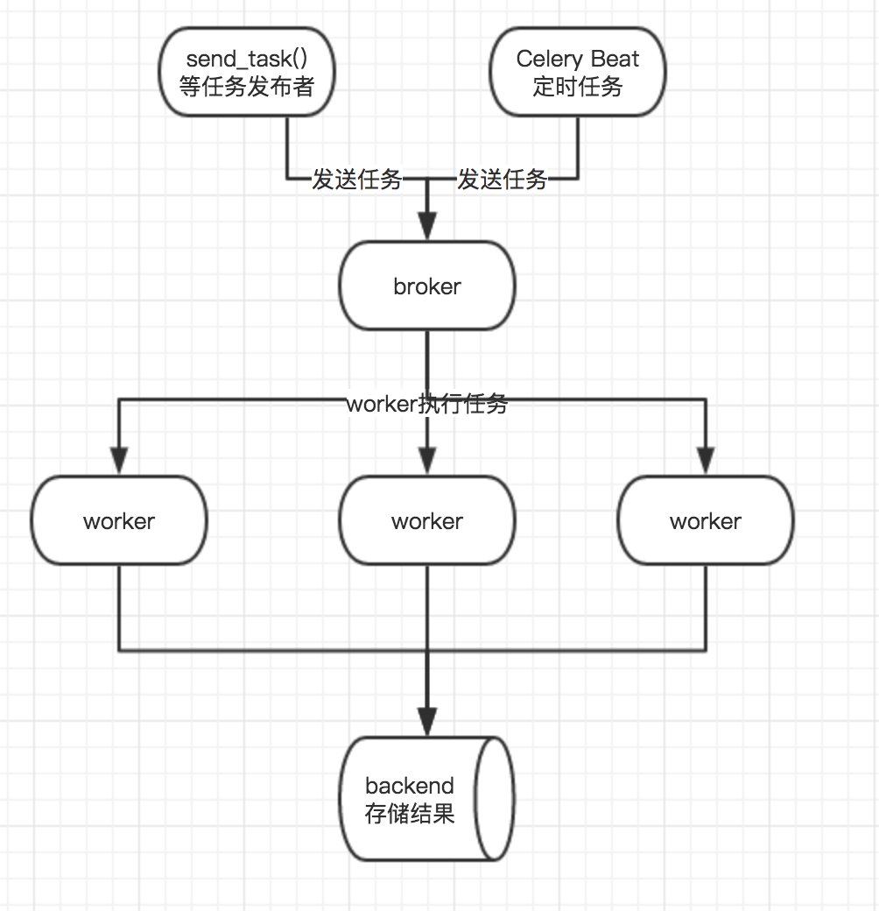

# 爬虫消息队列

由于celery只是任务队列，而不是真正意义上的消息队列，它自身不具有存储数据的功能，所以broker和backend需要通过第三方工具来存储信息，celery官方推荐的是 RabbitMQ和Redis，另外mongodb等也可以作为broker或者backend，可能不会很稳定，我们这里选择Redis作为broker兼backend。



```python
from celery import Celery

app = Celery('tasks', broker='redis://:''@223.129.0.190:6379/2', backend='redis://:''@223.129.0.190:6379/3')

@app.task
def add(x, y):
    return x + y

```


`celery -A tasks worker -l info`
-A指定的是app（celery实例所在的文件模块）；worker表示当前以worker的方式运行;-l info指定了日志等级为info。


## 定时任务
```python
from celery import Celery
app = Celery('add_tasks', broker='redis:''//223.129.0.190:6379/2', backend='redis:''//223.129.0.190:6379/3')
app.conf.update(
   #  配置所在时区
    CELERY_TIMEZONE='Asia/Shanghai',
    CELERY_ENABLE_UTC=True,
    #  官网推荐消息序列化方式为json
    CELERY_ACCEPT_CONTENT=['json'],
    CELERY_TASK_SERIALIZER='json',
    CELERY_RESULT_SERIALIZER='json',
   # 配置定时任务
    CELERYBEAT_SCHEDULE={
        'my_task': {
            'task': 'tasks.add',  # tasks.py模块下的add方法
            'schedule': 60,      # 每隔60运行一次
            'args': (23, 12),
        }
    }
)
@app.task
def add(x, y):
    return x + y
```

这时开启worker之后，还需要beat给它定时发送。
`celery beat -A tasks -l info`

>此外，还有一点需要注意，在celery4后，定时任务（通过schedule调度的会这样，通过crontab调度的会马上执行）会在当前时间再过定时间隔执行第一次任务，比如我这里设置的是60秒的间隔，那么第一次执行add会在我们通过celery beat -A tasks -l info启动定时任务后60秒才执行；celery3.1.25则会马上执行该任务.

## 发送任务
```python
#任务分发.py
url_list = [
    'http://docs.celeryproject.org/en/latest/getting-started/introduction.html',
    'http://docs.celeryproject.org/en/latest/getting-started/brokers/index.html',
    'http://docs.celeryproject.org/en/latest/userguide/periodic-tasks.html'
]
def manage_crawl_task(urls):
    for url in urls:
        app.send_task('tasks.crawl', args=(url,))
if __name__ == '__main__':
    manage_crawl_task(url_list)
```
然后，在节点A启动worker，再在节点B启动worker，
worker如下：
```python
from celery import Celery
app = Celery('crawl_task', include=['tasks'], broker='redis://223.129.0.190:6379/1', backend='redis://223.129.0.190:6379/2')
# 官方推荐使用json作为消息序列化方式
app.conf.update(
    CELERY_TIMEZONE='Asia/Shanghai',
    CELERY_ENABLE_UTC=True,
    CELERY_ACCEPT_CONTENT=['json'],
    CELERY_TASK_SERIALIZER='json',
    CELERY_RESULT_SERIALIZER='json',
)
```
这之后再运行任务分发。
可以看到两个节点都在执行抓取任务，并且它们的任务不会重复。

## 任务路由
`celery -A tasks.workers -Q login_queue,user_crawler worker -l info --concurrency=1 -Ofair`
login_queue，user_crawler是任务。

# Refs
- [如何构建一个分布式爬虫：基础篇](https://github.com/ResolveWang/WeiboSpider/wiki/%E5%A6%82%E4%BD%95%E6%9E%84%E5%BB%BA%E4%B8%80%E4%B8%AA%E5%88%86%E5%B8%83%E5%BC%8F%E7%88%AC%E8%99%AB%EF%BC%9A%E5%9F%BA%E7%A1%80%E7%AF%87)

- [如何构建一个分布式爬虫：实战篇F](https://github.com/ResolveWang/WeiboSpider/wiki/%E5%A6%82%E4%BD%95%E6%9E%84%E5%BB%BA%E4%B8%80%E4%B8%AA%E5%88%86%E5%B8%83%E5%BC%8F%E7%88%AC%E8%99%AB%EF%BC%9A%E5%AE%9E%E6%88%98%E7%AF%87)
